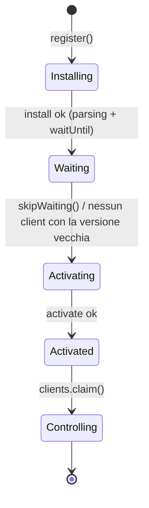

# 01 — Progressive Web App: come funziona la piattaforma

> Come fa una pagina web a **installarsi** come un'app e a **funzionare senza
> rete**. Il service worker come proxy nel browser, il suo ciclo di vita, la
> Cache Storage API. Esempi: [`sw.js`](../../sw.js),
> [`src/app/registra-sw.js`](../../src/app/registra-sw.js),
> [`manifest.webmanifest`](../../manifest.webmanifest).

---

## 1. Una PWA non è una tecnologia, è un insieme di API

«PWA» non è una libreria che si installa né un framework. È un'etichetta per un
sito web che usa alcune **API standard del browser** per comportarsi come
un'app installata:

- un **web app manifest** — un file JSON che dice al sistema operativo come
  installare e mostrare il sito (nome, icona, colori, modalità a tutto schermo);
- un **service worker** — uno script che il browser tiene in vita a parte e che
  può rispondere alle richieste di rete anche quando la pagina è chiusa o non
  c'è connessione;
- la **Cache Storage API** — un archivio di coppie richiesta/risposta HTTP, su
  cui il service worker appoggia i file da servire offline.

Niente di tutto questo richiede un passo di build o una dipendenza. È il motivo
per cui il vincolo del progetto — *zero build, zero backend* — è compatibile con
una PWA completa: sono tutte capacità **native** del browser.

> **Rispetto ad Angular.** Angular ha un pacchetto (`@angular/service-worker`)
> che *genera* un service worker per te a partire da una configurazione. Qui non
> c'è generazione: `sw.js` è scritto a mano, riga per riga. Vedere il file vero,
> senza uno strato che lo produce, è esattamente il punto di questo studio.

---

## 2. Il manifest: come il sistema operativo vede l'app

[`manifest.webmanifest`](../../manifest.webmanifest) è dichiarativo. Il browser
lo legge dal `<link rel="manifest">` e, se ci sono i requisiti (HTTPS o
localhost, un service worker, delle icone), offre «Installa».

```json
{
  "name": "PokéDeck Famiglia",
  "start_url": "./",
  "scope": "./",
  "display": "standalone",
  "theme_color": "#2a5fd6",
  "icons": [ … ]
}
```

Due campi meritano attenzione tecnica:

- **`display: standalone`** toglie la barra degli indirizzi: l'app aperta dalla
  home sembra nativa. È anche la ragione di un problema pratico che ritorna nel
  §5 — senza barra degli indirizzi **non c'è il pulsante ricarica**.
- **`scope` e `start_url` relativi** (`./`, non `/`). Un path assoluto `/`
  ancorerebbe l'app alla radice del dominio; ma su GitHub Pages il sito vive in
  una sottocartella (`utente.github.io/PokeDeckFamiglia/`). Il path relativo
  fa funzionare l'app in entrambi i casi. Lo stesso principio vale per **ogni**
  URL del progetto, service worker compreso.

---

## 3. Il service worker è un thread separato, senza DOM

Un service worker è un `Worker`: gira su un **thread proprio**, non ha accesso
al `document`, al `window`, né al DOM. Non può toccare la pagina. Comunica con
essa solo per messaggi (`postMessage`).

Il suo modello di esecuzione è **event-driven ed effimero**: il browser lo
sveglia quando c'è un evento (`install`, `activate`, `fetch`, `message`), gli fa
eseguire l'handler, e può **spegnerlo** subito dopo. Non è un processo che resta
in memoria: non tenere stato in variabili globali sperando di ritrovarlo.

```js
self.addEventListener('install',  (e) => { /* prepara la cache */ });
self.addEventListener('activate', (e) => { /* pulisci le cache vecchie */ });
self.addEventListener('fetch',    (e) => { /* rispondi alle richieste */ });
self.addEventListener('message',  (e) => { /* ricevi ordini dalla pagina */ });
```

L'analogia più vicina al tuo background non è Angular ma il lato server: un
service worker è come un **filtro servlet** o un **interceptor** che sta *davanti*
a ogni richiesta e decide cosa farne — solo che gira nel browser, per il tuo
sito soltanto.

### Lo scope: perché `sw.js` sta nella radice

Un service worker controlla solo gli URL **al suo livello o più in basso**. Un
worker registrato da `/app/sw.js` non potrebbe intercettare `/index.html`. Per
questo `sw.js` sta nella radice del progetto e non sotto `src/`:

```js
// registra-sw.js — lo scope è la cartella dell'app, non la radice del dominio
navigator.serviceWorker.register(new URL('../../sw.js', import.meta.url), {
  scope: './',
  updateViaCache: 'none',   // sw.js sempre fresco: è lui ad annunciare le versioni
});
```

---

## 4. Il ciclo di vita: install → wait → activate → controlling

Qui sta il cuore, e la parte che sorprende di più. Un service worker **non**
prende il comando appena registrato. Attraversa stati precisi:



- **Installing** — parte l'evento `install`. È il momento in cui si precarica il
  «guscio» dell'app. `event.waitUntil(promise)` dice al browser: *non
  considerare l'installazione finita finché questa promise non si risolve*.

  ```js
  self.addEventListener('install', (evento) => {
    evento.waitUntil((async () => {
      const cache = await caches.open(CACHE_GUSCIO);
      // ...precarica ogni file del guscio...
    })());
  });
  ```

- **Waiting** — se una versione precedente sta ancora controllando delle pagine,
  la nuova **aspetta**. Non si sostituisce a caldo: servirebbe file nuovi a una
  pagina che ha già in memoria i moduli vecchi, mescolando due versioni dell'app.
  Il worker nuovo resta in panchina finché tutte le schede con la versione
  vecchia non si chiudono — **oppure** finché qualcuno chiama `skipWaiting()`.

- **Activate** — quando prende servizio parte `activate`. È il posto giusto per
  **cancellare le cache vecchie**: ora si è sicuri che nessuna pagina le sta più
  usando.

  ```js
  self.addEventListener('activate', (evento) => {
    evento.waitUntil((async () => {
      const nomi = await caches.keys();
      await Promise.all(
        nomi.filter((n) => n.startsWith('pokedeck-') && !n.endsWith(VERSIONE))
            .map((n) => caches.delete(n)),
      );
      await self.clients.claim();   // prende il controllo delle pagine già aperte
    })());
  });
  ```

- **Controlling** — da qui il worker intercetta le `fetch` delle pagine nel suo
  scope. `clients.claim()` gli fa prendere il controllo anche delle schede già
  aperte, senza ricaricarle.

> **Il parallelo con `onupgradeneeded`.** Se hai letto
> [02 — IndexedDB](02-indexeddb.md), riconoscerai lo stesso schema: c'è **un solo
> momento** in cui è lecito toccare l'infrastruttura (lì lo schema del database,
> qui la cache dei file), scatenato da un cambio di versione. Fuori da quel
> momento, le strutture sono immutabili per il codice che le usa.

### Perché il progetto non si aggiorna da solo

`skipWaiting()` è potente e pericoloso: attivarsi subito butterebbe via lo stato
della pagina aperta (nel nostro caso, i mazzi appena generati). Perciò
[`registra-sw.js`](../../src/app/registra-sw.js) **non** lo chiama in automatico.
Aspetta che l'utente tocchi «Aggiorna» in una barra, e solo allora manda un
messaggio al worker in attesa:

```js
// pagina → worker
lavoratore.postMessage({ tipo: 'attiva-subito' });

// worker (sw.js)
self.addEventListener('message', (e) => {
  if (e.data?.tipo === 'attiva-subito') self.skipWaiting();
});
```

Quando il nuovo worker prende il comando scatta l'evento `controllerchange` sul
lato pagina, e *lì* si ricarica — non prima, o si rimetterebbe in piedi la
versione vecchia:

```js
navigator.serviceWorker.addEventListener('controllerchange', () => location.reload());
```

---

## 5. Intercettare le richieste: la Cache Storage API

Due archivi da non confondere:

- la **cache HTTP** del browser, quella di sempre, governata dagli header
  (`max-age`…). Non la controlli dal codice.
- la **Cache Storage API** (`caches`), un archivio programmabile di coppie
  `Request → Response` che *tu* riempi e svuoti. È questa che rende l'offline.

Nell'evento `fetch`, `event.respondWith(promise)` dice al browser: *non andare
in rete come faresti di solito, usa la risposta che ti do io*. Da qui nascono le
**strategie di caching**, una per tipo di risorsa:

```js
self.addEventListener('fetch', (evento) => {
  const url = new URL(evento.request.url);

  if (url.hostname === 'assets.tcgdex.net')      // immagini: scarica una volta, poi cache
    return evento.respondWith(cacheARichiesta(evento.request, CACHE_IMMAGINI));

  if (url.pathname.endsWith('version.json'))     // "sei aggiornato?": sempre rete
    return evento.respondWith(reteThenCache(evento.request));

  evento.respondWith(cachePrima(evento.request)); // guscio: prima la cache
});
```

Le tre strategie che vedi in `sw.js`:

| Strategia | Quando | Perché |
|---|---|---|
| **cache-first** | guscio dell'app (HTML/CSS/JS), indice dei set | apertura istantanea, offline garantito |
| **cache-on-demand** | file dei singoli set, immagini | 190 file / 6,4 MB: precaricarli tutti = scaricare l'intero catalogo alla prima apertura. Si salvano man mano che servono |
| **network-first** | `version.json` | deve riflettere il deploy corrente; la cache è solo riserva offline |

`cache-first` in essenza:

```js
async function cachePrima(richiesta) {
  const salvata = await caches.match(richiesta, { ignoreSearch: true });
  if (salvata) return salvata;          // c'è: rispondi al volo, niente rete
  return fetch(richiesta);              // manca: vai in rete (e magari salvala)
}
```

### La trappola delle risposte *opaque*

Un `` verso un altro dominio (le scansioni su `assets.tcgdex.net`) produce
una risposta **opaque**: per sicurezza il browser te la consegna ma non te ne
fa leggere niente, e `status` vale `0` — quindi `response.ok` è `false` **anche
quando è andata benissimo**. Se filtrassi con il solo `ok`, nessuna immagine
finirebbe mai in cache e offline sarebbero tutte vuote:

```js
if (risposta.ok || risposta.type === 'opaque') {
  await cache.put(richiesta, risposta.clone());   // .clone(): il corpo si legge una volta sola
}
```

(Rovescio della medaglia: essendo illeggibile, una risposta opaque viene salvata
anche se in realtà era un 404.)

---

## 6. Versionare e pubblicare

Cambiare **una costante** basta a pubblicare una versione nuova:

```js
const VERSIONE = 'v19';
const CACHE_GUSCIO = `pokedeck-guscio-${VERSIONE}`;
```

Il nome della cache contiene la versione: quando `activate` cancella «tutto
quello che non finisce con `v19`», le cache vecchie spariscono e restano solo
quelle nuove. Un'eccezione voluta: la cache dei **dati** (`pokedeck-dati`) non è
versionata, così i set già scaricati sopravvivono a un aggiornamento che magari
cambia solo un CSS.

Due dettagli d'installazione che valgono oro (imparati sbagliando, vedi i
commenti in `sw.js`):

- **`fetch(url, { cache: 'reload' })`** durante l'install scavalca la cache HTTP:
  senza, un file servito con `max-age` verrebbe ripescato vecchio e infilato
  *dentro* la cache nuova — si installerebbe una versione nuova piena di file
  vecchi.
- **niente `cache.addAll()`**: è tutto-o-niente e fallisce *in silenzio* se un
  file è stato rinominato. Un `Promise.allSettled` file per file installa quello
  che c'è e **avvisa** su quello che manca, invece di lasciare il worker vecchio
  al comando per sempre.

---

## 7. Verifica

1. Un service worker registrato da `/js/sw.js` riesce a intercettare la
   richiesta di `/index.html`? Perché sì o perché no?

2. Spiega con parole tue perché, dopo aver pubblicato una versione nuova,
   l'utente continua a vedere quella vecchia finché non tocca «Aggiorna». In
   quale **stato** del ciclo di vita è il worker nuovo, in quel frattempo?

3. `response.ok` è `false`. Da questa sola informazione, puoi concludere che la
   richiesta è fallita? (Suggerimento: `response.type`.)

4. Perché `version.json` usa *network-first* e non *cache-first* come tutto il
   resto del guscio? Cosa vedrebbe l'utente se sbagliassi strategia proprio su
   quel file?

5. **Esercizio.** Le immagini oggi restano in cache per sempre. Abbozza una
   strategia per tenere solo le ultime *N* immagini viste (una *cache LRU*).
   Quali API di `caches` ti servono? (Suggerimento: `cache.keys()` restituisce
   le `Request` salvate, in ordine di inserimento.)
