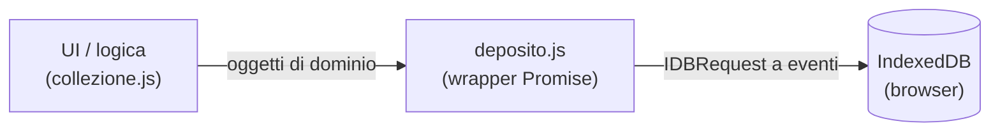

# 02 — IndexedDB: un database dentro il browser

> Com'è fatto l'archivio persistente del browser: object store, chiavi, indici,
> **versioni dello schema** e **transazioni**. Perché tutto è asincrono ed
> event-driven, e cosa cambia rispetto a JDBC. Esempio:
> [`src/data/deposito.js`](../../src/data/deposito.js), l'unico file che parla
> col database.

---

## 1. Che tipo di database è

IndexedDB è un database **transazionale a oggetti**, integrato nel browser e
locale al singolo dispositivo/origine. Non è SQL: non ci sono tabelle, righe,
colonne né `JOIN`. Ci sono:

- **object store** — contenitori di oggetti JavaScript, ognuno con una **chiave**.
  Concettualmente una grande `Map<chiave, oggetto>` che sopravvive alla chiusura
  del browser;
- **chiavi** — possono stare *dentro* l'oggetto (`keyPath`) o essere fornite a
  parte;
- **indici** — chiavi secondarie per cercare per un campo diverso dalla chiave
  primaria, senza scorrere tutto.

Gli oggetti si salvano per **clonazione strutturata**: non JSON, ma un algoritmo
del browser che sa serializzare anche `Date`, `Blob`, `Map`, `ArrayBuffer`. Quel
che metti dentro lo ritrovi com'era, tipi compresi.

> **Rispetto a JDBC.** Tre differenze da tenere a mente, tutte e tre importanti:
> 1. **NoSQL**: niente schema di colonne, salvi oggetti interi;
> 2. **asincrono**: nessuna chiamata blocca il thread (vedi §3);
> 3. **transazioni auto-committanti**: non chiami `commit()`, e non puoi tenere
>    una transazione «aperta» a piacere (vedi §5). È la trappola numero uno per
>    chi arriva da JDBC.

---

## 2. Aprire il database e versionare lo schema

Si apre con nome e **numero di versione**. Il numero è il perno di tutto: è ciò
che decide se lo schema va creato o migrato.

```js
const NOME_DB = 'pokedeck';
const VERSIONE_DB = 2;

const richiesta = indexedDB.open(NOME_DB, VERSIONE_DB);
```

Se la versione richiesta è più alta di quella salvata sul disco (o il database
non esiste), il browser scatena l'evento **`upgradeneeded`**. È **l'unico
momento** in cui si può modificare la struttura — creare store, creare indici:

```js
richiesta.onupgradeneeded = (evento) => {
  const db = richiesta.result;
  const daVersione = evento.oldVersion;   // 0 se è la prima volta

  // Migrazioni "a cascata", senza else: chi arriva da 0 le esegue tutte,
  // chi arriva da 1 solo quelle successive. Nessuno perde i dati che aveva.
  if (daVersione < 1) {
    const store = db.createObjectStore(STORE_COLLEZIONE, { keyPath: 'id' });
    store.createIndex('perSet', 'idSet', { unique: false }); // "tutte le carte del set X"
  }
  if (daVersione < 2) {
    db.createObjectStore(STORE_MAZZI, { keyPath: 'id' });
  }
};
```

Il pattern «a cascata di `if (daVersione < N)`» è il modo idiomatico di gestire
le migrazioni: ogni utente parte dalla versione che ha e applica solo i passi
mancanti. Sostituendo un `else`, chi installa la v2 partendo dalla v1 **non**
perde la collezione — proprio perché il passo `< 1` non viene rieseguito, ma
nemmeno saltato distruggendo ciò che c'era.

> **Rispetto a Java.** È lo stesso problema delle migrazioni Flyway/Liquibase:
> versioni progressive, ciascuna applicata una volta. Solo che qui la «migrazione»
> è codice imperativo dentro un evento, non un file `.sql` numerato, e gira sul
> dispositivo dell'utente al primo avvio della versione nuova.

### Una connessione, riusata

Aprire il database è costoso e va fatto una volta. `deposito.js` memorizza la
`Promise` e la restituisce sempre uguale:

```js
let connessione = null;

export function apri() {
  connessione ??= new Promise((risolvi, rifiuta) => {
    const richiesta = indexedDB.open(NOME_DB, VERSIONE_DB);
    richiesta.onupgradeneeded = /* …schema… */;
    richiesta.onsuccess = () => {
      const db = richiesta.result;
      // Se un'altra scheda apre una versione più nuova, questa va chiusa o
      // bloccherebbe l'upgrade dell'altra.
      db.onversionchange = () => { db.close(); connessione = null; };
      risolvi(db);
    };
    richiesta.onerror = () => rifiuta(richiesta.error);
    richiesta.onblocked = () => rifiuta(new Error('Bloccato da un\'altra scheda.'));
  });
  return connessione;
}
```

`onversionchange` e `onblocked` esistono perché il database è **condiviso fra le
schede** dello stesso sito: se una scheda vecchia lo tiene aperto, un'altra che
prova a migrare resta bloccata. Sono situazioni che in un'app desktop con un DB
per processo semplicemente non capitano.

---

## 3. Perché è tutto asincrono (e a eventi)

Ogni operazione restituisce una **`IDBRequest`**, non un valore. Il risultato
arriva più tardi, via evento `success`/`error`. È una scelta deliberata: il
database sta sul thread principale, lo stesso che disegna la UI, e un'operazione
**bloccante** congelerebbe la pagina. Nessuna chiamata IndexedDB blocca mai.

L'API a eventi è però verbosa e vecchia. Il trucco di `deposito.js` è
avvolgerla in una `Promise` **una volta sola**, così tutto il resto del codice
usa `await` normale:

```js
function promessa(richiesta) {
  return new Promise((risolvi, rifiuta) => {
    richiesta.onsuccess = () => risolvi(richiesta.result);
    richiesta.onerror   = () => rifiuta(richiesta.error);
  });
}
```

Da qui in poi `await promessa(store.get(chiave))` si legge come una query
sincrona, ma non lo è: sotto restano gli eventi.

> **Rispetto a JDBC.** In Java `resultSet = statement.executeQuery()` **blocca**
> il thread finché il database non risponde, e va benissimo perché sei su un
> thread di richiesta lato server. Nel browser non esiste quel lusso: c'è un solo
> thread per la UI, e bloccarlo significa una pagina che non risponde ai tocchi.

---

## 4. Leggere e scrivere

Le operazioni sono elementari, da dizionario: `get`, `getAll`, `put`, `delete`,
`clear`. `put` fa *insert-or-replace* (upsert), con la chiave presa dal `keyPath`
dell'oggetto:

```js
export function leggiTutto(nomeStore) {           // SELECT *
  return inTransazione(nomeStore, 'readonly',  (s) => promessa(s.getAll()));
}
export function scrivi(nomeStore, riga) {         // INSERT ... ON CONFLICT REPLACE
  return inTransazione(nomeStore, 'readwrite', (s) => promessa(s.put(riga)));
}
export function cancella(nomeStore, chiave) {     // DELETE WHERE key = ?
  return inTransazione(nomeStore, 'readwrite', (s) => promessa(s.delete(chiave)));
}
```

Per cercare su un campo che non è la chiave si usa l'**indice** dichiarato in
`upgradeneeded`: `store.index('perSet').getAll(idSet)` restituisce tutte le
carte di un set senza scorrere l'intera collezione — l'equivalente di un indice
SQL, con lo stesso scopo (evitare la scansione completa).

---

## 5. Le transazioni, e la trappola dell'auto-commit

**Ogni** operazione avviene dentro una transazione, esplicita o implicita. Una
transazione ha uno **scope** (quali store tocca) e un **modo**:

- `readonly` — più transazioni di lettura possono girare in parallelo;
- `readwrite` — presa in esclusiva sugli store nel suo scope.

Qui arriva la differenza che spiazza chi viene da JDBC. Una transazione IndexedDB
**si chiude da sola** — fa *commit* automatico — non appena il ciclo di eventi
resta senza richieste in sospeso su di lei. Non c'è `commit()` da chiamare; ma
soprattutto **non puoi tenerla aperta** mettendoci in mezzo un `await` su
qualcosa di estraneo (una `fetch`, un `setTimeout`): al risveglio la troveresti
già chiusa (`TransactionInactiveError`).

```js
export async function inTransazione(nomeStore, modo, lavoro) {
  const db = await apri();
  const transazione = db.transaction(nomeStore, modo);
  const store = transazione.objectStore(nomeStore);

  const risultato = await lavoro(store);   // SOLO operazioni sullo store, qui dentro

  // Si aspetta il `complete` della transazione — il commit vero, non la singola
  // richiesta: solo dopo si è certi che una lettura successiva vedrà i dati.
  await new Promise((risolvi, rifiuta) => {
    transazione.oncomplete = () => risolvi();
    transazione.onerror    = () => rifiuta(transazione.error);
    transazione.onabort    = () => rifiuta(transazione.error);
  });
  return risultato;
}
```

Regola pratica, incisa nei commenti di `deposito.js`: **dentro una transazione
si fanno solo operazioni sullo store, e nient'altro**. Se ti serve un dato dalla
rete, prima lo scarichi, *poi* apri la transazione.

L'atomicità serve davvero: l'import «sostituisci tutto» scrive centinaia di
righe in **una sola** transazione, così un errore a metà non lascia la
collezione dimezzata — o passano tutte, o nessuna:

```js
export function scriviMolte(nomeStore, righe) {
  return inTransazione(nomeStore, 'readwrite', async (store) => {
    await Promise.all(righe.map((r) => promessa(store.put(r))));  // tutte nella stessa tx
    return righe.length;
  });
}
```

> **Rispetto a JDBC.** In Java la transazione la apri, la tieni quanto vuoi
> (magari mentre chiami un servizio esterno) e chiudi con `commit()`/`rollback()`
> espliciti. In IndexedDB è **l'opposto**: vive solo per la durata di una
> sequenza ininterrotta di operazioni sul database, e si chiude appena ti fermi.
> Un `await fetch()` in mezzo non «sospende» la transazione: la uccide.

---

## 6. Dove finisce IndexedDB e comincia il significato

Nota di architettura: `deposito.js` non sa **nulla** di carte, tipi o mazzi.
Conserva righe con una chiave e le rende. Il significato — che quella riga è una
carta posseduta, che la chiave è `"<idSet>:<numero>"` — lo dà il livello sopra
(`collezione.js`). Il wrapper è generico apposta: è la stessa separazione tra un
DAO e la logica di dominio, e permette di provarlo senza sapere cosa contiene.



---

## 7. Verifica

1. Perché IndexedDB non può avere un'API sincrona come `resultSet.next()` di
   JDBC? Cosa succederebbe alla pagina se ce l'avesse?

2. Hai questo codice dentro una transazione `readwrite`:

   ```js
   const carta = await promessa(store.get('sv08:118'));
   const prezzo = await fetch(`/api/prezzo/${carta.id}`).then((r) => r.json());
   await promessa(store.put({ ...carta, prezzo }));   // ← spesso fallisce. Perché?
   ```

   Spiega perché l'ultima riga può lanciare `TransactionInactiveError`, e come
   ristruttureresti il codice per evitarlo.

3. `VERSIONE_DB` passa da 2 a 3 e aggiungi uno store `preferiti`. Scrivi il
   blocco `if (daVersione < 3)` in `upgradeneeded`. Perché **non** devi toccare
   i blocchi `< 1` e `< 2` esistenti?

4. Che differenza c'è tra aspettare `richiesta.onsuccess` e aspettare
   `transazione.oncomplete`? In scrittura, quale dei due garantisce che una
   lettura immediatamente successiva veda il dato?

5. **Esercizio.** La collezione è cercabile per chiave (`idSet:numero`) e per set
   (indice `perSet`). Vuoi anche «tutte le carte di un certo tipo». Che indice
   aggiungeresti, in quale versione dello schema, e come lo interrogheresti?
