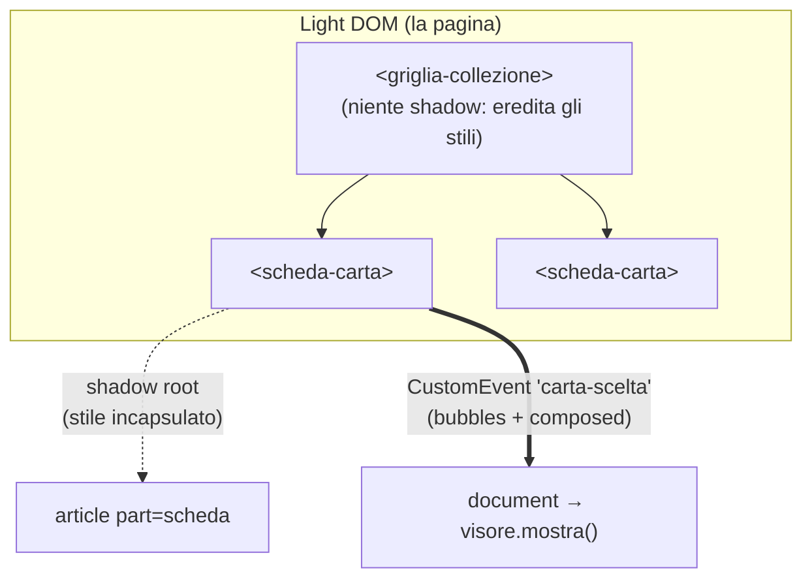

# 03 — Web Components: componenti nativi del browser

> Come si costruisce un elemento riutilizzabile **senza framework né build**: i
> Custom Elements, il loro ciclo di vita, il Shadow DOM per l'incapsulamento, e
> la comunicazione per proprietà ed eventi. Il confronto costante è con Angular,
> perché è lì che questi concetti hanno un gemello. Esempi:
> [`src/ui/scheda-carta/`](../../src/ui/scheda-carta/),
> [`src/ui/visore-carta/`](../../src/ui/visore-carta/).

---

## 1. Tre standard, un componente

«Web Components» è l'ombrello su tre API distinte del browser, usabili anche da
sole:

1. **Custom Elements** — definire un tag HTML nuovo (`<scheda-carta>`) sostenuto
   da una classe JavaScript;
2. **Shadow DOM** — dare all'elemento un albero interno e uno stile
   **incapsulati**, che non escono e non fanno entrare lo stile di pagina;
3. **HTML Templates** (`<template>`, `<slot>`) — markup inerte da clonare.

Il progetto usa a fondo i primi due. Sono tutti **nativi**: nessuna dipendenza,
nessuna compilazione, il browser li esegue direttamente. È il motivo per cui i
Web Components sono la scelta obbligata sotto il vincolo *zero build* — e allo
stesso tempo un'ottima palestra, perché vedi il meccanismo scoperto, senza lo
strato che Angular ci mette sopra.

---

## 2. Custom Elements: una classe che diventa un tag

Un custom element è una classe che estende `HTMLElement` e viene **registrata**
con un nome:

```js
export class SchedaCarta extends HTMLElement { /* … */ }
customElements.define('scheda-carta', SchedaCarta);
```

Il nome **deve** contenere un trattino (`scheda-carta`, non `scheda`): è la
regola che garantisce al browser che non collida mai con un tag HTML standard,
presente o futuro. Da quel momento `<scheda-carta>` nel markup, o
`document.createElement('scheda-carta')`, istanzia la tua classe.

L'elemento è un vero nodo del DOM: ha proprietà, metodi, eventi. Puoi dargli
un'API pubblica come a qualunque oggetto — ed è così che ci si comunica (§5).

---

## 3. Il ciclo di vita

Il browser chiama dei metodi noti in momenti precisi. Sono l'equivalente degli
hook di Angular, con nomi diversi:

| Callback | Quando | Gemello Angular |
|---|---|---|
| `constructor` | l'elemento viene creato | `constructor` |
| `connectedCallback` | entra nel DOM | `ngOnInit` / `ngAfterViewInit` |
| `disconnectedCallback` | esce dal DOM | `ngOnDestroy` |
| `attributeChangedCallback` | cambia un attributo osservato | `ngOnChanges` (per i soli attributi) |

```js
export class VisoreCarta extends HTMLElement {
  constructor() {
    super();
    // Regola: nel constructor NON si tocca ancora il contenuto né si leggono
    // attributi — l'elemento potrebbe non essere ancora nel documento. Qui si
    // fa solo il minimo, come creare lo shadow root.
    this.attachShadow({ mode: 'open' });
  }

  connectedCallback() {
    // Qui sì: costruire il markup, agganciare i listener. È il vero "onInit".
    this.shadowRoot.innerHTML = `…`;
    this.shadowRoot.querySelector('.chiudi').addEventListener('click', () => this.chiudi());
  }
}
```

Attenzione a `connectedCallback`: scatta **ogni volta** che l'elemento entra nel
DOM, non solo la prima. Se sposti un elemento, viene richiamato. Il codice deve
esserne consapevole (o proteggersi con un flag «già inizializzato»).

### `attributeChangedCallback` è selettivo

Reagisce solo agli attributi elencati in `observedAttributes`, un getter
statico. È l'equivalente di dichiarare quali `@Input` vuoi osservare:

```js
static get observedAttributes() { return ['aperto']; }
attributeChangedCallback(nome, vecchio, nuovo) { /* reagisci */ }
```

---

## 4. Niente change detection: ti ridisegni a mano

Questa è **la** differenza con Angular, e va interiorizzata. Angular ha un
sistema di *change detection*: cambi una proprietà del componente e il framework
si accorge da solo che il template va riaggiornato. **I Web Components non hanno
niente del genere.** Non c'è nessuno che sorveglia le tue proprietà.

Il pattern idiomatico è: esporre una proprietà con un **setter** che, oltre a
salvare il valore, richiama un metodo di ridisegno.

```js
export class SchedaCarta extends HTMLElement {
  #carta = null;

  set carta(valore) {     // <-- l'input del componente
    this.#carta = valore;
    this.#disegna();      // <-- il ridisegno lo scateni TU, esplicitamente
  }
  get carta() { return this.#carta; }

  #disegna() {
    if (!this.shadowRoot || !this.#carta) return;
    this.shadowRoot.innerHTML = `<article>…${this.#carta.nome}…</article>`;
  }
}
```

Uso:

```js
const scheda = document.createElement('scheda-carta');
scheda.carta = { nome: 'Zweilous', tipi: ['Oscurità'], ps: 100 }; // il setter ridisegna
document.body.append(scheda);
```

È più manuale, ma anche più trasparente: sai **esattamente** quando e perché il
DOM cambia, senza cicli di detection da capire o ottimizzare. Il rovescio è che
la responsabilità è tua: dimentica di chiamare `#disegna()` e la UI resta
indietro rispetto ai dati.

> **Rispetto ad Angular.** Là scrivi `{{ carta.nome }}` nel template e il binding
> fa il resto. Qui il «binding» è codice che scrivi a mano nel setter. Non c'è
> magia — e non c'è nemmeno il costo, né i tranelli, della change detection.

---

## 5. Comunicazione: proprietà dentro, eventi fuori

Lo stesso schema di Angular (`@Input` / `@Output`), realizzato con strumenti del
DOM:

- **verso il componente** → proprietà/attributi (il setter `carta` del §4). È
  l'`@Input`.
- **dal componente verso il mondo** → un **`CustomEvent`**. È l'`@Output`.

```js
// dentro <scheda-carta>: "mi hanno cliccato", senza sapere chi ascolta
this.dispatchEvent(new CustomEvent('carta-scelta', {
  bubbles: true,     // sale lungo l'albero del DOM
  composed: true,    // ATTRAVERSA il confine dello Shadow DOM (vedi §6)
  detail: { carta: this.#carta, nomeSet: this.#nomeSet },
}));
```

Chi la usa ascolta come per qualunque evento del DOM:

```js
document.addEventListener('carta-scelta', (e) => visore.mostra(e.detail.carta));
```

Il disaccoppiamento è totale: la scheda **non sa** che esiste un visore. Annuncia
un fatto; chi ascolta decide cosa farne. Ed essendo un vero evento del DOM,
`bubbles: true` lo fa salire lungo l'albero — così un contenitore intermedio può
intercettarlo e persino arricchirne il `detail` mentre passa, senza che la
sorgente ne sappia nulla (è come la propagazione di eventi vera, non un
`EventEmitter` che collega due punti fissi).

---

## 6. Shadow DOM: incapsulare markup e stile

`attachShadow({ mode: 'open' })` dà all'elemento un albero interno separato, lo
**shadow root**. Ciò che ci metti dentro:

- **non è raggiunto** dai selettori CSS della pagina;
- **non raggiunge** con i suoi stili il resto della pagina.

È l'incapsulamento che in Angular ottieni con `ViewEncapsulation.Emulated` — solo
che Angular lo *emula* riscrivendo i selettori con attributi univoci, mentre lo
Shadow DOM è un confine **reale** imposto dal browser.

```js
this.attachShadow({ mode: 'open' });
this.shadowRoot.innerHTML = `<article>…</article>`;
```

### Stili: un foglio condiviso, costruito una volta

Con centinaia di schede in griglia, ricreare il CSS per ognuna sarebbe uno
spreco. Il pattern del progetto: un unico `CSSStyleSheet`, caricato una volta,
**adottato** da tutte le istanze (i browser lo condividono, non lo duplicano):

```js
const stile = new CSSStyleSheet();
const cssCaricato = fetch(new URL('./scheda-carta.css', import.meta.url))
  .then((r) => r.text())
  .then((css) => stile.replaceSync(css));

// in connectedCallback, dopo che il foglio è pronto:
this.shadowRoot.adoptedStyleSheets = [stile];
```

### Bucare il confine, ma con giudizio: `::part()`

A volte la pagina *deve* poter stilare un pezzo interno — per esempio riusare la
scheda dentro un riquadro con bordo diverso. Il componente decide cosa esporre
con l'attributo `part`, e solo quello è raggiungibile da fuori:

```html
<!-- dentro lo shadow -->
<article part="scheda">…</article>
```
```css
/* nella pagina: lecito, perché il componente l'ha esposto */
.proposta scheda-carta::part(scheda) { border-color: transparent; }
```

È incapsulamento con delle **porte dichiarate**: fuori si tocca solo ciò che il
componente ha scelto di rendere toccabile, non le sue interiora.

### Il costo dell'isolamento

Lo Shadow DOM non è gratis in comodità. Due esempi reali dal progetto:

- `loading="lazy"` su un `` inserito via `innerHTML` dentro uno shadow root
  **non si attiva**: è stato sostituito con un `IntersectionObserver` che carica
  l'immagine solo quando la scheda sta per entrare nel viewport.
- il reset globale (`box-sizing: border-box` in `base.css`) **non attraversa** il
  confine: dentro lo shadow, se serve, va ridichiarato.

Non usare lo Shadow DOM *per abitudine*: serve quando c'è dello stile da
proteggere. Difatti `griglia-collezione`, che ospita altri componenti e vuole
ereditare gli stili di pagina, **non** lo usa. `scheda-carta`, che porta il suo
look, sì.

---

## 7. Il quadro d'insieme



- ogni `scheda-carta` è un custom element con il **suo** shadow root e stile;
- riceve dati per **proprietà** (`.carta`, `.nomeSet`) e si **ridisegna a mano**;
- comunica in su con un **CustomEvent** che, grazie a `composed`, esce dallo
  shadow e, grazie a `bubbles`, sale fino al `document`.

---

## 8. Verifica

1. Perché `customElements.define('scheda', …)` (senza trattino) lancia un
   errore, mentre `'scheda-carta'` va bene?

2. Assegni `elemento.carta = nuovaCarta` ma il componente **non** si aggiorna.
   In Angular ti aspetteresti che il binding lo faccia. Qual è la causa più
   probabile qui, e dov'è il codice che «fa da binding»?

3. Un `CustomEvent` con `bubbles: true` ma **senza** `composed: true`, emesso da
   dentro uno shadow root: dove arriva e dove si ferma? Perché nel progetto
   serve anche `composed`?

4. `connectedCallback` può essere chiamato **più di una volta** sullo stesso
   elemento. In quale situazione succede, e che problema darebbe se ci
   agganciassi un listener ogni volta senza rimuoverlo?

5. Quando ha senso dare a un componente lo Shadow DOM e quando no? Motiva la
   scelta opposta fra `scheda-carta` (ce l'ha) e `griglia-collezione` (non ce
   l'ha).

6. **Esercizio.** Trasforma il contatore di una quantità in un mini custom
   element `<contatore-copie>` che espone la proprietà `valore` e emette un
   evento `cambiato` col nuovo valore nel `detail`. Elenca: nome del tag, dove
   metti il ridisegno, e con quali flag emetti l'evento.
